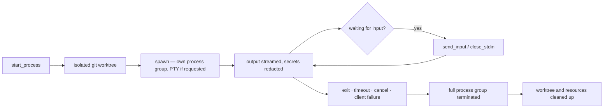

<h1 align="center">cue</h1>

<p align="center">
  <strong>Capture anything. Delegate anything. Record a moment once — keep the note, or let your agent start the work.</strong>
</p>

<p align="center">
  cue (working name <em>Capture → Delegate</em>) is an open-source, local-first macOS app that records intentional spoken sessions — meetings, in-person conversations, voice notes — and turns them into source-grounded notes and approved, traceable agent runs. Nothing spoken by another participant can authorize execution; every run shows exactly what the agent may read, change, or execute.
</p>

<p align="center">
  <a href=".loop/roadmap.md"><strong>Roadmap</strong></a> ·
  <a href="backend/src/lib.rs"><strong>Run protocol</strong></a> ·
  <a href="scripts/verify-m0.sh"><strong>Verification</strong></a>
</p>

<p align="center">
  
  
  
  
  
  
  
</p>

## Product

Note-taking products end at the action item. cue continues:

```
spoken session
→ source-grounded note
→ approved action
→ structured task packet
→ manual or autonomous agent run
→ result
→ human decision
→ updated project context
```

The app is useful without agents — a private, polished recording and notes application. When a captured session contains something you want researched, reviewed, planned, or built, an action card carries the objective, the exact transcript quote that produced it, a permission level, and a deliverable; one click hands it to Codex, Claude Code, or any agent behind the provider-neutral adapter API. Conversation is context, not authority: authorization comes only from you — a direct command, a click, or a policy you configured in advance.

## Status

This repository is the foundation, built bottom-up in verified slices. It is **not** the completed product or an MVP — capture, transcription, and notes have not started yet. What is merged is the process runtime everything else lands on.

| Milestone | State | What it delivered |
| --- | --- | --- |
| **M0 — Foundation** | Merged | Native SwiftUI client and a separate Rust backend completing a versioned health handshake over a Unix domain socket |
| **M1 — Run engine** | Merged, paused for user testing | Delegated process execution over the socket protocol: bounded output streaming, per-run timeouts, cancellation, full process-group kill, clean SIGTERM/SIGINT shutdown, pause/resume, stdin semantics, run metadata with secret redaction, real PTY on request, waiting-for-input detection, isolated git worktrees, guaranteed termination under client I/O failure, hardened resource lifecycle |
| **M2+ — Capture, transcription, notes, actions** | Not started | The product layer described in the spec |



## Architecture

| Layer | Stack | Role |
| --- | --- | --- |
| Client | Swift 6, SwiftUI | Native macOS app; `CaptureDelegateIPC` speaks the socket protocol |
| IPC | Unix domain socket, versioned JSON | Every message carries `"version": 1`; the health handshake is the compatibility gate |
| Backend | Rust 2024, single crate | Owns process execution; the client never spawns work itself |
| Run engine | process groups, PTY, timeouts | Delegated commands run in their own group in an isolated git worktree; cancel, timeout, shutdown, and client death all kill the whole group |
| Redaction | streamed-output filter | Secret values are scrubbed before output reaches the socket; run metadata is recorded value-free |
| Verification | `scripts/` + 122 tests | `verify-m0.sh` runs the traceability check and full suites; `verify-app-launch.sh` proves a real visible window via System Events |

## What It Proves

| Question | cue answer |
| --- | --- |
| Can a run outlive a crashed or wedged client? | No. Termination is guaranteed under client I/O failure — if the backend can no longer write to you, the run and its whole process group die rather than run headless. |
| Can a cancelled run leave orphans? | No. Cancel, timeout, and backend shutdown (SIGTERM/SIGINT) all kill the full process group, not just the direct child. |
| Does a delegated run touch your checkout? | No. Runs execute in isolated git worktrees, created per run and cleaned up afterwards. |
| Can secrets leak through streamed output? | Streamed output is redacted before it crosses the socket, and recorded run metadata never carries values. |
| Can an interactive tool that demands a TTY run? | Yes. A run can request a real PTY, and the backend detects when it is waiting for input so the client can respond with `send_input` or `close_stdin` instead of hanging. |
| Is any of this taken on faith? | No. Every slice landed with tests (97 Rust, 25 Swift) and a traceability ledger in [`.loop/`](.loop/) linking each requirement to its verification. |

## Run Protocol

One versioned JSON protocol over the Unix socket:

| | |
|---|---|
| `health` → `health_response` | version handshake; the M0 contract |
| `start_process` | spawn a delegated command — worktree, timeout, optional PTY |
| `send_input` · `close_stdin` | drive an interactive run |
| `pause_process` · `resume_process` | suspend and continue the process group |
| `cancel_process` | terminate the run and its entire group |

## Verify

Prerequisites: macOS 14+, Swift 6.0, Rust/Cargo.

```sh
scripts/verify-m0.sh
```

For native-app runtime evidence — a visible, non-background process with a real window:

```sh
swift build -c release --disable-sandbox
scripts/verify-app-launch.sh
```

The launch smoke is intentionally not part of `verify-m0.sh`: GitHub's macOS runners have no reliable interactive WindowServer session, so it would be flaky headless.

## What It Is Not

Not a meeting bot — capture is intentional and visible, never secret or always-on. Not an IDE, a workflow builder, or a transcript-search memory product. Not a proprietary coding agent: Codex, Claude Code, and future agents are adapters over one neutral task schema, not the data model. And not finished — today this repo is the hardened run engine; the recorder, notes, and action cards come next.

## License

Apache-2.0
